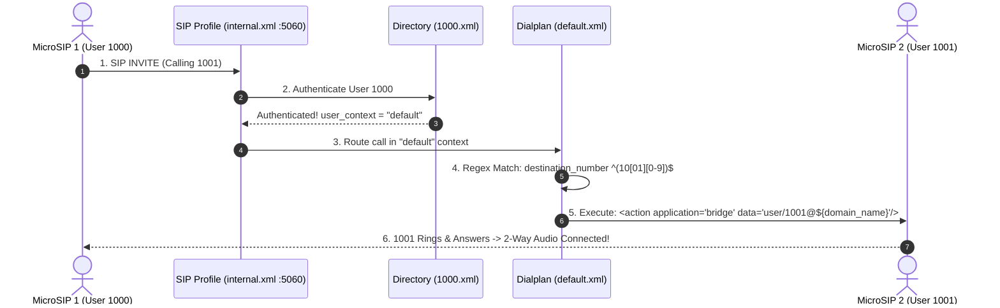
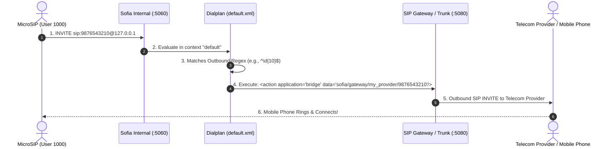
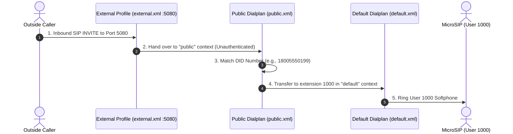

# FreeSWITCH Post-Installation & Softphone Connection Guide

This guide documents the exact steps and network fixes required to connect a SIP softphone (such as **MicroSIP** or **Zoiper**) to a newly compiled FreeSWITCH server running in **Docker on Windows**.

---

## 📋 Table of Contents
1. [Overview of the Connection Challenges](#1-overview-of-the-connection-challenges)
2. [Step-by-Step Fixes Applied](#2-step-by-step-fixes-applied)
   - [Fix 1: Docker Desktop Port Mapping](#fix-1-docker-desktop-port-mapping)
   - [Fix 2: Setting the SIP Domain in `vars.xml`](#fix-2-setting-the-sip-domain-in-varsxml)
   - [Fix 3: Event Socket IPv4 Binding](#fix-3-event-socket-ipv4-binding)
   - [Fix 4: RTP Port Range Lockdown](#fix-4-rtp-port-range-lockdown)
   - [Fix 5: Docker NAT & SDP Advertising](#fix-5-docker-nat--sdp-advertising-fix-for-inbound--outbound-no-voice)
3. [MicroSIP Configuration Guide](#3-microsip-configuration-guide)
4. [Testing Your FreeSWITCH Connection](#4-testing-your-freeswitch-connection)
5. [Reloading Configurations & Useful CLI Commands](#5-reloading-configurations--useful-cli-commands)
6. [FreeSWITCH Core Architecture: The 3 Pillars](#6-freeswitch-core-architecture-the-3-pillars)
7. [How Call Routing Works (Step-by-Step Call Flows)](#7-how-call-routing-works-step-by-step-call-flows)
   - [Flow 1: Calling an Internal Extension](#flow-1-calling-an-internal-extension-eg-1000-dials-1001)
   - [Flow 2: Calling an External Phone Number via Gateway](#flow-2-calling-an-external-phone-number-via-a-sip-trunk--gateway)
   - [Flow 3: Receiving an Inbound Call from Outside (PSTN / DID)](#flow-3-receiving-an-inbound-call-from-outside-sip-trunk--did-number)
8. [Quick Configuration Cheat-Sheet](#8-quick-configuration-cheat-sheet)

---

## 1. Overview of the Connection Challenges

After a fresh FreeSWITCH build inside Docker on Windows, two major hurdles prevent softphones from connecting to `127.0.0.1:5060`:

| Issue | Root Cause | Symptom |
| :--- | :--- | :--- |
| **Docker Host Networking** | On Windows, `network_mode: host` runs inside the hidden WSL2 Linux VM, meaning ports are **not published to Windows localhost**. | Softphones show *"Connection timeout"* / *"Could not connect to server"*. |
| **Domain Auto-Discovery** | FreeSWITCH auto-discovers external/WAN IPs and sets `$${domain}` to that IP instead of `127.0.0.1`. | Softphones get `403 Forbidden` or `404 Not Found` upon SIP registration. |
| **IPv6 Event Socket** | Default `event_socket.conf.xml` binds to `::` (IPv6), causing `fs_cli` connection failures on IPv4-only networks. | `fs_cli` outputs `[ERROR] Error Connecting []`. |

---

## 2. Step-by-Step Fixes Applied

### Fix 1: Docker Desktop Port Mapping
In [`docker-compose.yml`](file:///c:/Users/tusha/Desktop/freeswitch/docker-compose.yml), replace `network_mode: host` with explicit port forwarding so Windows ports map directly into the container:

```yaml
services:
  freeswitch:
    image: my-freeswitch-image:latest
    container_name: freeswitch-learning

    ports:
      # SIP Signaling (Internal - Port 5060 for Softphones)
      - "5060:5060/tcp"
      - "5060:5060/udp"

      # SIP Signaling (External / Trunks - Port 5080)
      - "5080:5080/tcp"
      - "5080:5080/udp"

      # Event Socket Layer (fs_cli - Port 8021)
      - "8021:8021/tcp"

      # RTP Audio/Video Media Ports Range
      - "16384-16484:16384-16484/udp"
```

---

### Fix 2: Setting the SIP Domain in `vars.xml`
In [`conf/vars.xml`](file:///c:/Users/tusha/Desktop/freeswitch/conf/vars.xml), update the domain variables so FreeSWITCH accepts SIP registrations intended for `127.0.0.1`:

```xml
<!-- Set domain to 127.0.0.1 for local softphone registrations -->
<X-PRE-PROCESS cmd="set" data="domain=127.0.0.1"/>
<X-PRE-PROCESS cmd="set" data="domain_name=127.0.0.1"/>
```

---

### Fix 3: Event Socket IPv4 Binding
In [`conf/autoload_configs/event_socket.conf.xml`](file:///c:/Users/tusha/Desktop/freeswitch/conf/autoload_configs/event_socket.conf.xml), update `listen-ip` to bind to all IPv4 interfaces:

```xml
<configuration name="event_socket.conf" description="Socket Client">
  <settings>
    <param name="nat-map" value="false"/>
    <param name="listen-ip" value="0.0.0.0"/>
    <param name="listen-port" value="8021"/>
    <param name="password" value="ClueCon"/>
  </settings>
</configuration>
```

---

### Fix 4: RTP Port Range Lockdown
In [`conf/autoload_configs/switch.conf.xml`](file:///c:/Users/tusha/Desktop/freeswitch/conf/autoload_configs/switch.conf.xml), restrict FreeSWITCH to only allocate RTP ports that match Docker's published UDP range (`16384-16484`):

```xml
<param name="rtp-start-port" value="16384"/>
<param name="rtp-end-port" value="16484"/>
```

---

### Fix 5: Docker NAT & SDP Advertising (Fix for Inbound & Outbound "No Voice")
When FreeSWITCH runs inside Docker on Windows:
- **Outbound calls (`originate`)** require setting `external_rtp_ip=127.0.0.1` and `NDLB-force-rport`.
- **Inbound calls (dialing `9196` from MicroSIP)** require overriding `local-network-acl` so FreeSWITCH does not falsely classify host RFC1918 IPs as internal container LAN (`172.19.0.x`).

1. In [`conf/vars.xml`](file:///c:/Users/tusha/Desktop/freeswitch/conf/vars.xml):
   ```xml
   <X-PRE-PROCESS cmd="set" data="external_rtp_ip=127.0.0.1"/>
   <X-PRE-PROCESS cmd="set" data="external_sip_ip=127.0.0.1"/>
   ```

2. In [`conf/autoload_configs/acl.conf.xml`](file:///c:/Users/tusha/Desktop/freeswitch/conf/autoload_configs/acl.conf.xml):
   ```xml
   <!-- Deny localnet classification so all host traffic receives 127.0.0.1 in SDP -->
   <list name="localnet" default="deny">
   </list>
   ```

3. In [`conf/sip_profiles/internal.xml`](file:///c:/Users/tusha/Desktop/freeswitch/conf/sip_profiles/internal.xml):
   ```xml
   <!-- Disable default nat.auto and point local-network-acl to our deny list -->
   <!-- <param name="apply-nat-acl" value="nat.auto"/> -->
   <param name="local-network-acl" value="localnet"/>
   <param name="aggressive-nat-detection" value="true"/>
   <param name="NDLB-force-rport" value="true"/>
   <param name="ext-rtp-ip" value="$${external_rtp_ip}"/>
   <param name="ext-sip-ip" value="$${external_sip_ip}"/>
   ```

---

## 3. MicroSIP Configuration Guide

Open **MicroSIP**, click the top-right menu **▼** ➡️ **Add Account**, and configure:

| Field | Value | Notes |
| :--- | :--- | :--- |
| **Account Name** | `1000` | Friendly name for the account |
| **SIP Server** | `127.0.0.1:5060` | FreeSWITCH internal SIP port |
| **SIP Proxy** | *(Leave Blank)* | Not needed for direct connection |
| **User** | `1000` | Default pre-configured extension |
| **Domain** | `127.0.0.1` | Must match domain in `vars.xml` |
| **Login / Auth ID** | `1000` | Extension number |
| **Password** | `1234` | Default FreeSWITCH user password |
| **Display Name** | `Extension 1000` | Caller ID name |
| **Media Encryption** | `Disabled` | Set to Disabled for plain RTP |
| **Transport** | `UDP` | Standard VoIP signaling transport |

👉 Click **Save**. The status indicator in the bottom-left will turn **🟢 Online**.

---

## 4. Testing Your FreeSWITCH Connection

Once MicroSIP displays **Online**, dial these built-in test extensions:

### 1. Echo Test (`9196`)
* **Action**: Dial `9196` and press Call.
* **What happens**: The server answers and echoes back whatever you speak into your microphone in real time.
* **Purpose**: Tests bi-directional RTP audio streams and latency.

### 2. Music on Hold (`9198`)
* **Action**: Dial `9198` and press Call.
* **What happens**: Plays high-definition Music on Hold (8kHz/16kHz/32kHz/48kHz audio streams).
* **Purpose**: Verifies audio codec decoding (Opus, PCMU, PCMA).

### 3. Interactive Voice Menu (`5000`)
* **Action**: Dial `5000` and press Call.
* **What happens**: The automated demo IVR welcomes you and invites you to press DTMF digits (`1`, `2`, `3`).
* **Purpose**: Tests IVR routing, DTMF detection, and sound prompt playback.

---

## 5. Reloading Configurations & Useful CLI Commands

### When and How to Apply Changes (`reloadxml` vs Restarts)

Whenever you modify an XML configuration file, use this table to know exactly what to reload:

| What File You Modified | Command to Run | What it Does |
| :--- | :--- | :--- |
| **Dialplans** (`default.xml`, `public.xml`) | `reloadxml` | Immediately updates routing rules in memory without dropping calls. |
| **Users / Directory** (`1000.xml`, `1001.xml`, passwords) | `reloadxml` | Updates user credentials and extension settings. |
| **SIP Profiles & Gateways** (`internal.xml`, `external.xml`) | `reloadxml`<br>then `sofia profile internal restart` | Re-initializes SIP sockets, NAT settings, and SIP credentials. |
| **ACL Network Lists** (`acl.conf.xml`) | `reloadxml`<br>then `reloadacl` | Rebuilds IP access control allow/deny tables in memory. |
| **Core Switch Settings** (`switch.conf.xml`, RTP port ranges) | `docker restart freeswitch-learning` | Full server restart required for low-level core engine parameters. |

---

### Useful CLI Commands in `fs_cli`

Open the FreeSWITCH console:
```bash
docker exec -it freeswitch-learning fs_cli
```

Inside `fs_cli`:

```text
# 1. Reload configurations:
reloadxml                                # Reloads XML dialplans and user directory
reloadacl                                # Reloads ACL IP lists
sofia profile internal restart           # Restarts the internal SIP profile

# 2. View softphone registrations:
show registrations                       # Lists all connected softphones (IP, user, port)

# 3. View live channels and active calls:
show channels                            # Shows live channels
show calls                               # Shows active connected calls

# 4. Check SIP profile status & SIP debugging:
sofia status                             # Overall Sofia status
sofia status profile internal            # Details on internal IP, port, codecs, NAT
sofia profile internal siptrace on       # Turns on live SIP packet logging
sofia profile internal siptrace off      # Turns off SIP packet logging

# 5. Live log levels:
log 7                                    # Debug level (maximum detail)
log 6                                    # Info level (clean standard logs)
log 0                                    # Mutes console logs
```

#### Running Commands Directly from Windows PowerShell:
```powershell
docker exec freeswitch-learning /usr/local/freeswitch/bin/fs_cli -x "reloadxml"
docker exec freeswitch-learning /usr/local/freeswitch/bin/fs_cli -x "sofia profile internal restart"
```

---

## 6. FreeSWITCH Core Architecture: The 3 Pillars

To understand FreeSWITCH call routing easily, think of FreeSWITCH as having **3 main pillars**:

```
 ┌───────────────────────────┐      ┌───────────────────────────┐      ┌───────────────────────────┐
 │     1. SIP PROFILES       │      │       2. DIRECTORY        │      │       3. DIALPLAN         │
 │  (Doors / Interfaces)     │ ───► │  (Users / Accounts)       │ ───► │  (Brain / Routing Logic)  │
 │  conf/sip_profiles/       │      │  conf/directory/          │      │  conf/dialplan/           │
 └───────────────────────────┘      └───────────────────────────┘      └───────────────────────────┘
```

| Component | What it is | Real-World Analogy | Key Configuration File |
| :--- | :--- | :--- | :--- |
| **1. SIP Profile** | Network endpoints listening on IP/Ports for SIP packets. | The **Entrance Door** to the building. | [`conf/sip_profiles/internal.xml`](file:///c:/Users/tusha/Desktop/freeswitch/conf/sip_profiles/internal.xml) (Port 5060)<br>[`conf/sip_profiles/external.xml`](file:///c:/Users/tusha/Desktop/freeswitch/conf/sip_profiles/external.xml) (Port 5080) |
| **2. Directory** | Database of registered users, extensions, passwords, and assigned permissions. | The **Employee ID Badges** & security list. | [`conf/directory/default/1000.xml`](file:///c:/Users/tusha/Desktop/freeswitch/conf/directory/default/1000.xml) |
| **3. Dialplan** | Ordered list of rules (conditions) and actions that decide what to do with a dialed number. | The **Phone Operator / Switchboard** routing instructions. | [`conf/dialplan/default.xml`](file:///c:/Users/tusha/Desktop/freeswitch/conf/dialplan/default.xml) (Internal)<br>[`conf/dialplan/public.xml`](file:///c:/Users/tusha/Desktop/freeswitch/conf/dialplan/public.xml) (Inbound from outside) |

---

## 7. How Call Routing Works (Step-by-Step Call Flows)

### Flow 1: Calling an Internal Extension (e.g., `1000` dials `1001`)



#### What happens step-by-step:
1. **SIP Arrival**: MicroSIP (User 1000) sends `INVITE sip:1001@127.0.0.1:5060`.
2. **Authentication**: Sofia checks [`conf/directory/default/1000.xml`](file:///c:/Users/tusha/Desktop/freeswitch/conf/directory/default/1000.xml). It sees `<variable name="user_context" value="default"/>`.
3. **Dialplan Search**: FreeSWITCH enters [`conf/dialplan/default.xml`](file:///c:/Users/tusha/Desktop/freeswitch/conf/dialplan/default.xml) and looks for a matching `<extension>`:
   ```xml
   <!-- Matches 1000 to 1019 -->
   <extension name="Local_Extension">
     <condition field="destination_number" expression="^(10[01][0-9])$">
       <!-- Bridges the call to the registered device of user 1001 -->
       <action application="bridge" data="user/$1@${domain_name}"/>
     </condition>
   </extension>
   ```
4. **Bridge Application**: FreeSWITCH checks if User `1001` is registered, sends an INVITE to `1001`'s softphone, and connects the audio streams.

---

### Flow 2: Calling an External Phone Number via a SIP Trunk / Gateway

When an internal user dials an outside number (e.g., `9876543210` or a mobile number):



#### The Outbound Dialplan Rule ([`conf/dialplan/default.xml`](file:///c:/Users/tusha/Desktop/freeswitch/conf/dialplan/default.xml)):
```xml
<extension name="Outbound_Calls">
  <!-- Matches any 10-digit dialed number -->
  <condition field="destination_number" expression="^(\d{10})$">
    <!-- Sets your Outbound Caller ID -->
    <action application="set" data="effective_caller_id_number=18005550199"/>
    <!-- Bridges call to your configured SIP Trunk Gateway -->
    <action application="bridge" data="sofia/gateway/my_sip_provider/$1"/>
  </condition>
</extension>
```

---

### Flow 3: Receiving an Inbound Call from Outside (SIP Trunk / DID Number)

When an outside caller calls your phone number from the public telephone network (PSTN):



#### Why `public.xml` exists (Security!):
- Calls from the outside world enter on **Port 5080** (`external.xml`), which assigns `context="public"`.
- `public.xml` only allows routing to specific pre-approved DIDs, IVRs, or extensions. It **prevents outside callers from abusing your system** to make toll calls.

---

## 8. Quick Configuration Cheat-Sheet

### How to Add a New User (Extension `1001`):
1. Copy [`conf/directory/default/1000.xml`](file:///c:/Users/tusha/Desktop/freeswitch/conf/directory/default/1000.xml) to `conf/directory/default/1001.xml`.
2. Change `id="1000"` to `id="1001"`, and change `effective_caller_id_number` to `1001`.
3. In `fs_cli`, run `reloadxml`.
4. Configure softphone 2 with User `1001`, Domain `127.0.0.1`, Password `1234`.

### Key Dialplan Applications:
| Application | What it does | Example |
| :--- | :--- | :--- |
| **`answer`** | Answers the incoming call immediately (sends SIP 200 OK). | `<action application="answer"/>` |
| **`bridge`** | Connects the caller to another destination (phone, trunk, user). | `<action application="bridge" data="user/1001@${domain}"/>` |
| **`playback`** | Plays a `.wav` sound file to the caller. | `<action application="playback" data="ivr/ivr-welcome.wav"/>` |
| **`echo`** | Echoes audio back to the caller (test tool). | `<action application="echo"/>` |
| **`sleep`** | Pauses execution for $N$ milliseconds. | `<action application="sleep" data="2000"/>` |
| **`transfer`** | Sends the call to another extension or context in the dialplan. | `<action application="transfer" data="1000 XML default"/>` |
| **`hangup`** | Terminates the call. | `<action application="hangup"/>` |
