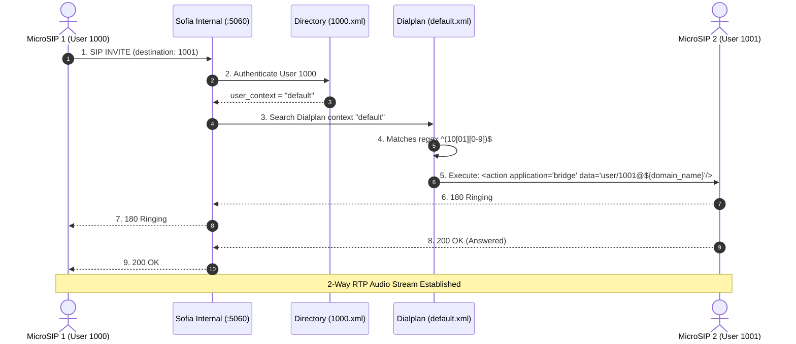
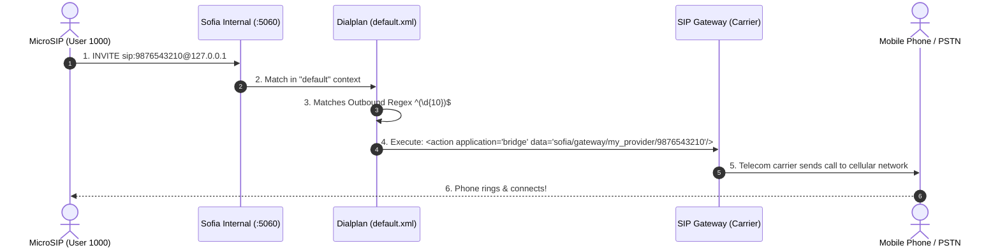
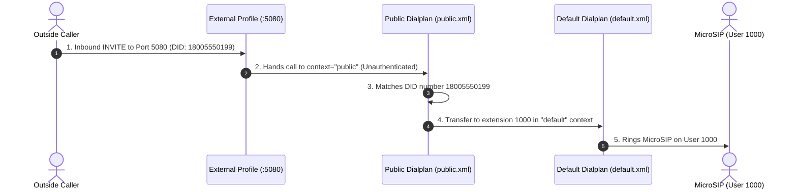

# Chapter 05: Call Routing & Call Flows

This chapter walks through the complete step-by-step SIP signaling and media call flows for:
1. **Internal Extension-to-Extension Calls** (`1000` $\rightarrow$ `1001`)
2. **Outbound Calls via a Gateway / SIP Trunk** (`1000` $\rightarrow$ Mobile Number)
3. **Inbound Calls from the Public Network / Carrier** (PSTN $\rightarrow$ DID $\rightarrow$ Extension)

---

## 1. Flow 1: Internal Calling (`1000` dials `1001`)



### The XML Dialplan Rule in `default.xml`:
```xml
<extension name="Local_Extension">
  <!-- Matches any 4-digit number between 1000 and 1019 -->
  <condition field="destination_number" expression="^(10[01][0-9])$">
    <!-- 1. Set ringback tone -->
    <action application="set" data="ringback=${us-ring}"/>
    <!-- 2. Set timeout to 30 seconds before going to voicemail -->
    <action application="set" data="call_timeout=30"/>
    <action application="set" data="hangup_after_bridge=true"/>
    <action application="set" data="continue_on_fail=true"/>
    <!-- 3. Bridge the call to the registered contact of the dialed user -->
    <action application="bridge" data="user/$1@${domain_name}"/>
    <!-- 4. If no answer, send to voicemail -->
    <action application="answer"/>
    <action application="sleep" data="1000"/>
    <action application="bridge" data="loopback/app=voicemail:default ${domain_name} $1"/>
  </condition>
</extension>
```

---

## 2. Flow 2: Outbound Calls via SIP Trunk / Gateway

When an employee dials an outside number (e.g. `9876543210`):



### The XML Outbound Rule:
```xml
<extension name="Outbound_PSTN">
  <!-- Matches any 10-digit number -->
  <condition field="destination_number" expression="^(\d{10})$">
    <action application="set" data="effective_caller_id_number=18005550199"/>
    <action application="bridge" data="sofia/gateway/my_carrier_gateway/$1"/>
  </condition>
</extension>
```

---

## 3. Flow 3: Inbound Calls from Outside Carrier (DID / PSTN)

When an outside customer dials your business phone number:



### The XML Inbound Rule in `public.xml`:
```xml
<extension name="Inbound_DID_Routing">
  <condition field="destination_number" expression="^18005550199$">
    <!-- Route to extension 1000 or to an IVR menu -->
    <action application="transfer" data="1000 XML default"/>
  </condition>
</extension>
```

---

👉 Next: Continue to **[Chapter 06: Dialplan Deep Dive & Custom Extensions](file:///c:/Users/tusha/Desktop/freeswitch/learning/06_dialplan_deep_dive.md)**
